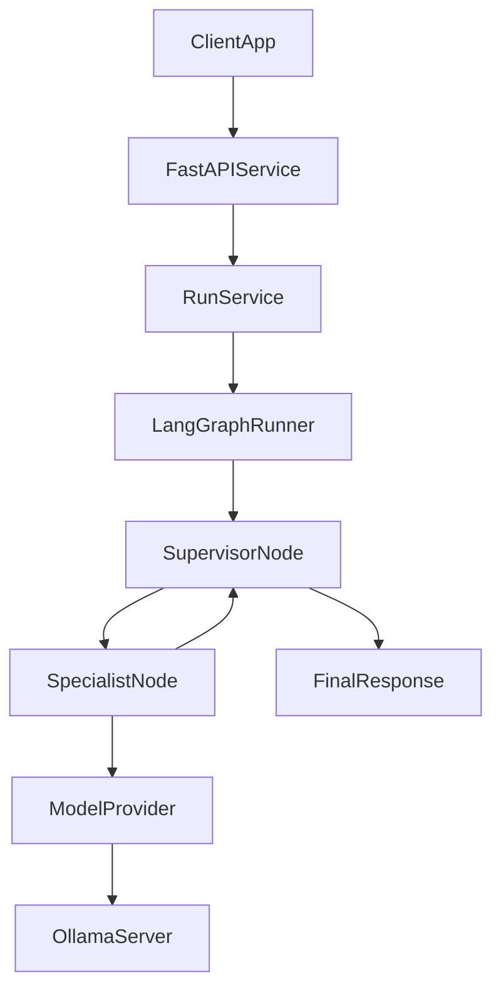

# LangGraph Multi-Agent Services

This project will become a small backend service that runs a LangGraph-based multi-agent workflow behind an API.

## What This Project Is

The goal is to build a service where:

- a client sends a request to an API
- the API starts a LangGraph run
- a supervisor node decides which specialist agent should work next
- specialist nodes call a model provider and optional tools
- the graph returns a final response

## Why We Are Building It This Way

We are separating the system into clear layers because that makes the project easier to understand, test, and evolve.

- `API layer`: receives requests from users or other apps
- `graph layer`: coordinates the workflow and routing logic
- `provider layer`: talks to Ollama first, and later can talk to other model providers
- `tool layer`: gives agents extra capabilities like search or retrieval
- `state layer`: stores the shared run state that every graph node reads and updates

This matters because LangGraph should manage orchestration, while Ollama should only act as the model server. That keeps us from mixing application flow with provider-specific code.

## Build-Time vs Runtime

This distinction is important because different files matter at different moments.

### Build-Time

These files are used when setting up or packaging the project:

- `pyproject.toml`
- `Dockerfile`
- `docker-compose.yml`
- `.env.example`

They do not handle user requests directly. They help install dependencies, define startup commands, and configure local development.

### Runtime

These files run when the backend process is started and receives traffic:

- `src/app.py`
- `src/config.py`
- `src/api/routes.py`
- `src/graph/builder.py`
- `src/graph/state.py`
- `src/providers/ollama_provider.py`

These are the files that will actually process requests, call LangGraph, and talk to Ollama.

## Written Code vs External Systems

We will write the application code in this repository.

- `FastAPI` will expose HTTP endpoints
- `LangGraph` will run the workflow
- our own Python code will define nodes, state, config, and routing

We will not write Ollama itself here.

- `Ollama` is an external model server
- this project will call Ollama over HTTP
- if we later switch providers, the graph should not need a major rewrite

## Planned Runtime Flow

## Planned Phase 1

Phase 1 is intentionally small so the architecture stays understandable.

We will build:

1. project scaffold and dependency setup
2. config loading for runtime settings
3. a provider interface with an Ollama implementation
4. a FastAPI app with a health endpoint
5. a LangGraph state object
6. one supervisor node and one specialist node
7. one API route that runs the graph
8. basic logging and focused tests

## Why Start Small

A multi-agent system gets complicated quickly.

We are deliberately not starting with:

- many specialist agents
- long-term memory
- RAG pipelines
- Redis queues
- multiple services
- cloud deployment complexity

We want one end-to-end path working first so we can prove:

- the request flow is clear
- the state shape makes sense
- Ollama integration works
- the graph is easy to debug

## Planned File Order

To keep implementation reviewable, we will build one file at a time in this order:

1. `README.md`
2. `pyproject.toml`
3. `.env.example`
4. `src/config.py`
5. `src/providers/base.py`
6. `src/providers/ollama_provider.py`
7. `src/app.py`
8. `src/schemas.py`
9. `src/api/routes.py`
10. `src/graph/state.py`
11. `src/graph/nodes/supervisor.py`
12. `src/graph/nodes/specialist.py`
13. `src/graph/builder.py`
14. `src/services/run_service.py`

## Current Status

The repository is currently at the documentation-first stage.

This file defines the big picture so the next implementation steps are easier to follow.
