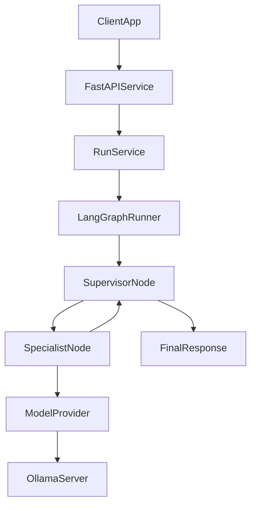

# LangGraph Multi-Agent Services

This project is a small backend service that runs a LangGraph-based multi-agent workflow behind an API.

## What This Project Is

The goal is to build a service where:

- a client sends a request to an API
- the API starts a LangGraph run
- a supervisor node decides which specialist agent should work next
- specialist nodes call a model provider and optional tools
- the graph returns a final response

## Why We Are Building It This Way

We are separating the system into clear layers because that makes the project easier to understand, test, and evolve.

- `API layer`: receives requests from users or other apps
- `graph layer`: coordinates the workflow and routing logic
- `provider layer`: talks to Ollama first, and later can talk to other model providers
- `tool layer`: gives agents extra capabilities like search or retrieval
- `state layer`: stores the shared run state that every graph node reads and updates

This matters because LangGraph should manage orchestration, while Ollama should only act as the model server. That keeps us from mixing application flow with provider-specific code.

## Build-Time vs Runtime

This distinction is important because different files matter at different moments.

### Build-Time

These files are used when setting up or packaging the project:

- `pyproject.toml`
- `Dockerfile`
- `docker-compose.yml`
- `.env.example`

They do not handle user requests directly. They help install dependencies, define startup commands, and configure local development.

### Runtime

These files run when the backend process is started and receives traffic:

- `src/app.py`
- `src/config.py`
- `src/api/routes.py`
- `src/graph/builder.py`
- `src/graph/state.py`
- `src/providers/ollama_provider.py`

These are the files that will actually process requests, call LangGraph, and talk to Ollama.

## Written Code vs External Systems

We will write the application code in this repository.

- `FastAPI` will expose HTTP endpoints
- `LangGraph` will run the workflow
- our own Python code will define nodes, state, config, and routing

We will not write Ollama itself here.

- `Ollama` is an external model server
- this project will call Ollama over HTTP
- if we later switch providers, the graph should not need a major rewrite

## Current Runtime Flow



## What Already Exists

The current repository already includes the first end-to-end runtime path:

1. `src/app.py` creates the FastAPI app and attaches the shared router.
2. `src/api/routes.py` exposes `GET /health` and `POST /runs`.
3. `src/services/run_service.py` creates the provider and compiled graph for a run.
4. `src/graph/builder.py` assembles the supervisor and specialist nodes into a LangGraph workflow.
5. `src/providers/ollama_provider.py` adapts our provider contract to Ollama through LangChain.
6. `tests/` contains focused smoke tests for the health route, run route, and service orchestration.

That means the architecture is no longer just planned. The request path is now implemented in code, even though local verification still depends on installing dev dependencies and, for full real execution, having Ollama available.

## What Still Needs Setup

Some parts of the project structure exist conceptually but are not finished operationally yet:

- dev dependencies still need to be installed locally before `pytest` can run
- the project does not yet include Docker files
- the current graph uses one specialist node and simple deterministic routing
- long-term memory, RAG, and multi-specialist orchestration are still future phases

## Local Setup

Use these steps when you want to run the current project locally.

### 1. Create a Virtual Environment

```bash
python3 -m venv .venv
source .venv/bin/activate
```

This is a build/setup step, not runtime logic. It creates an isolated Python environment for this repository so installs and test tools do not affect your global Python setup.

### 2. Install Dependencies

```bash
python -m pip install -e ".[dev]"
```

This installs:

- the application itself in editable mode
- runtime dependencies such as `fastapi`, `langgraph`, and `langchain-ollama`
- dev dependencies such as `pytest`, `httpx`, and `ruff`

### 3. Create a Local Env File

```bash
cp .env.example .env
```

This is still setup, not runtime execution. The `.env` file is what `src/config.py` reads when the server process starts.

### 4. Start Ollama

Make sure the Ollama app or server is running locally, and make sure the configured model exists.

Example:

```bash
ollama pull llama3.1
```

Ollama runs as a separate external service. Our application does not start Ollama itself. At runtime, `src/providers/ollama_provider.py` sends requests to the Ollama HTTP server configured in `.env`.

### 5. Run the API Server

```bash
.venv/bin/uvicorn src.app:app --reload --host 0.0.0.0 --port 8000
```

This is the runtime entrypoint:

- `uvicorn` starts the FastAPI server process
- `src.app:app` loads the application object from `src/app.py`
- `src/app.py` includes the shared router from `src/api/routes.py`
- `POST /runs` calls `RunService`, which builds and runs the LangGraph workflow

### 6. Run Focused Tests

```bash
.venv/bin/python -m pytest tests/test_health.py tests/test_run_flow.py tests/test_run_service.py
```

These tests verify:

- app startup and `/health`
- route-to-service wiring for `/runs`
- service-to-graph/provider orchestration behavior

### 7. Try the API Manually

Health:

```bash
curl http://127.0.0.1:8000/health
```

Run flow:

```bash
curl -X POST http://127.0.0.1:8000/runs \
  -H "Content-Type: application/json" \
  -d '{"prompt":"Say hello from LangGraph"}'
```

## Phase 1 Scope

Phase 1 is intentionally small so the architecture stays understandable.

We will build:

1. project scaffold and dependency setup
2. config loading for runtime settings
3. a provider interface with an Ollama implementation
4. a FastAPI app with a health endpoint
5. a LangGraph state object
6. one supervisor node and one specialist node
7. one API route that runs the graph
8. basic logging and focused tests

## Why Start Small

A multi-agent system gets complicated quickly.

We are deliberately not starting with:

- many specialist agents
- long-term memory
- RAG pipelines
- Redis queues
- multiple services
- cloud deployment complexity

We want one end-to-end path working first so we can prove:

- the request flow is clear
- the state shape makes sense
- Ollama integration works
- the graph is easy to debug

## Planned File Order

To keep implementation reviewable, we will build one file at a time in this order:

1. `README.md`
2. `pyproject.toml`
3. `.env.example`
4. `src/config.py`
5. `src/providers/base.py`
6. `src/providers/ollama_provider.py`
7. `src/app.py`
8. `src/schemas.py`
9. `src/api/routes.py`
10. `src/graph/state.py`
11. `src/graph/nodes/supervisor.py`
12. `src/graph/nodes/specialist.py`
13. `src/graph/builder.py`
14. `src/services/run_service.py`

## Current Status

The repository now has:

- Python project metadata and local env templates
- config, provider, graph, and service layers
- FastAPI app startup and live route wiring
- focused API and service smoke tests

The next major step is environment verification: install dependencies, run the tests, and then decide whether to extend the graph or sync the new work to `prod`.
